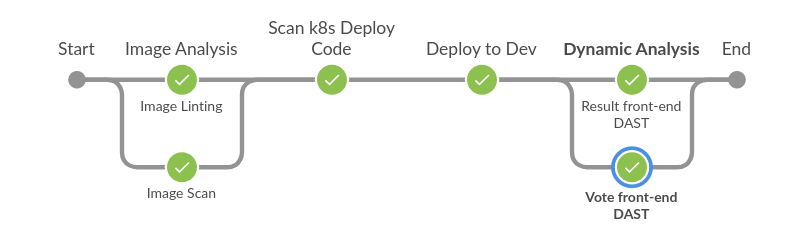

# Instavote App - Continuous Deployment with ArgoCD

Deploy the applications
-----

#### Manually  
Deploy the applications on Kubernetes with ArgoCD manually, using the manifests in `<application-name>/deployments` folder.

- or

#### Automatically  
Deploy by executing: `$ ansible-playbook deploy-instavote.yml`, inside the `argo-gitops/instavote/` folder.

Create Continuous Deployment Pipelines
-----
##### This is the CD Pipeline for all the apps:

#### 01. Allow Jenkins to Deploy on ArgoCD
Execute: `$ ansible-playbook allow-jenkins.yml`, inside the `argo-gitops/jenkins/` folder.  

#### 02. Create the Pipelines
01. Add the following variables as secret text, in `Manage Jenkins > Manage Credentials > Global`:
- argocd-jenkins-deployer-token = The token produced in the previous step.
- argo-server-ip                = in the form of [IP]:[port]
- vote-app-url                  = in the form of http://[IP]:[port]
- result-app-url                = in the form of http://[IP]:[port]

02. Create a new Jenkins Multibranch Pipeline <b>for each app</b> (db,redis,result,worker,vote) with:
- Source as GitHub repo (eg. https://github.com/xvag/instavote-cd-argo.git)
- Build mode "by Jenkinsfile" with Script Path pointing to the Jenkinsfile (eg. worker/Jenkinsfile)

### General Requirements:
- Working Kubernetes Cluster
- Working ArgoCD Setup
- Working Jenkins Setup, with Kubernetes Cloud
- Ansible (with kubernetes module)
- kubectl (configured with the working kubernetes cluster)
- argocd CLI (logged in to the ArgoCD server)
